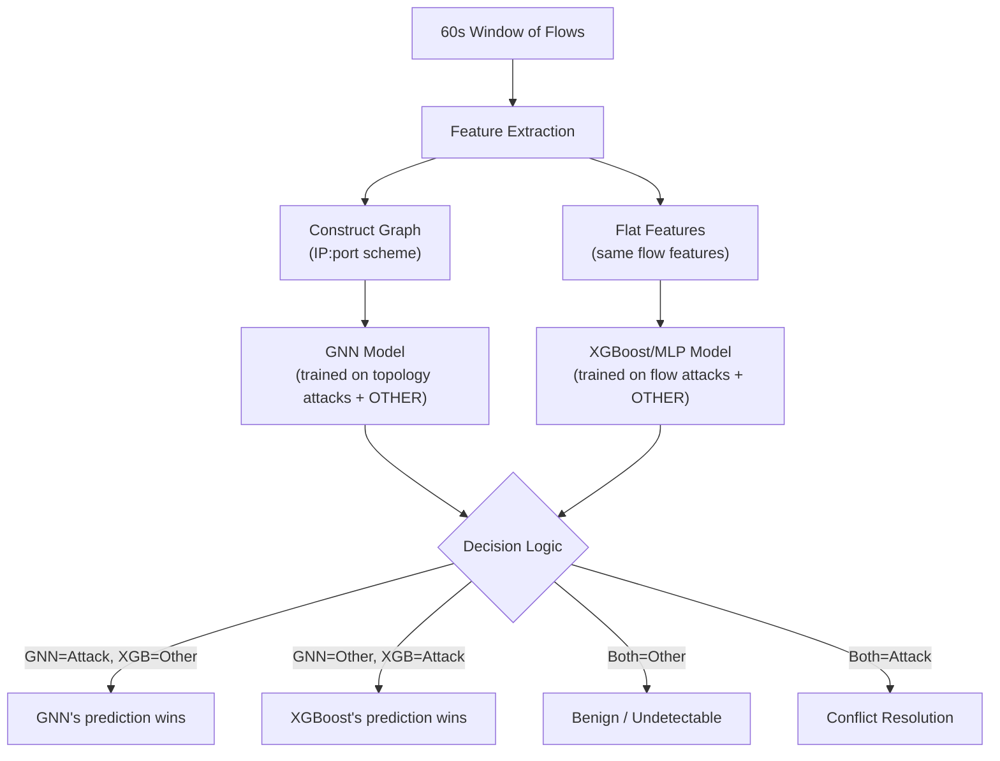

# Future Scope: Parallel Dual-Model NIDS Architecture

## 1. Attack-Type Graph Topology Reasoning

> [!IMPORTANT]
> The key insight driving future development is that graph topology should encode different attack types differently. Currently, some attacks are invisible or poorly captured by the graph topology.

| Attack Type | Flow Pattern | Current Graph Encodes It? | Why Not |
| :--- | :--- | :--- | :--- |
| **DDoS (HOIC, LOIC)** | Many→one fan-in burst | ✅ Partially | IP:port node has high in-degree. GNN can detect this via aggregation. |
| **SSH/FTP BruteForce** | One→one repeated | ⚠️ Poorly | Multiple edges between same src:port→dst:port pair collapse into repeated edges with similar features. The count of attempts is lost. |
| **Botnet** | Many↔many C&C pattern | ✅ Well | Star topology around C&C server is well-captured. |
| **SlowHTTPTest/Slowloris** | One→one, long-lived, low-rate | ❌ No | Looks identical to Benign HTTP. Flow features alone (bytes, packets, duration) overlap with Benign. Needs temporal signal. |
| **Reconnaissance/Scanning** | One→many fan-out | ✅ Partially | High out-degree from scanner. But 60s window may miss the full scan. |
| **Backdoor/Shellcode** | Single anomalous flow | ❌ No | Single edge with no distinguishing graph topology. XGBoost is better (uses raw features). |
| **XSS/SQL Injection** | Single HTTP request | ❌ No | Payload-level attack — completely invisible in NetFlow features. Need packet inspection. |

---

## 2. Proposed Architecture: Parallel Dual-Model

The future architecture shifts from a complex sequential 3-stage routing pipeline to a highly efficient **Parallel Dual-Model Pipeline**. Both models run simultaneously on the same 60-second window flow data.

### 2.1 Architectural Flow

### 2.2 Legacy vs. Proposed Pipeline

**Legacy (3-Stage Routing Pipeline):**
1. **Binary Gate (XGBoost):** Benign vs Attack (99.5% recall target).
2. **Group Router (XGBoost):** Determines which specialist handles this attack.
3. **Specialists:** Per-group model predicts the exact attack class.

**Proposed (Parallel Dual-Model):**
Instead of routing, both models process the data simultaneously. Each model is trained on its respective attack types plus an **"OTHER"** class (which includes Benign flows, attacks handled by the other model, and undetectable attacks).

---

## 3. Model Assignments & Training Strategy

### 3.1 Model Specialization

#### UNSW (10 classes)

| Specialist | Classes | Model |
| :--- | :--- | :--- |
| **Topology** | Fuzzers, Recon | E-GraphSAGE (fan-in/fan-out signals) |
| **Flat Features** | Generic, Exploits, DoS, Shellcode, Analysis | XGBoost + SMOTE |
| **Anomaly** | Backdoor, Worms | Isolation Forest |

#### CICIDS (15 classes)

| Specialist | Classes | Model |
| :--- | :--- | :--- |
| **DDoS/DoS Volume** | HOIC, LOIC-HTTP, LOIC-UDP, Hulk, GoldenEye | E-GraphSAGE (fan-in graphs, 10s windows) |
| **Brute Force** | SSH, FTP, Web | E-GraphSAGE (edge multiplicity feature, 300s windows) |
| **Bot** | Bot | HeteroGNN (star topology, 600s windows) |
| **Slow DoS** | Slowloris | XGBoost (flow features) |
| **Infiltration** | Infilteration | XGBoost + SMOTE |
| **EXCLUDED** | SlowHTTPTest, XSS, SQLi | Documented as NetFlow-undetectable |

### 3.2 Dual-Model Training Phase

| Model | Training Classes | "Other" Class Includes |
| :--- | :--- | :--- |
| **GNN (E-GraphSAGE)** | Fuzzers, Recon, DDoS-HOIC, DDoS-LOIC-*, DoS-Hulk, DoS-GoldenEye, Bot, SSH-Brute, FTP-Brute, Web-Brute + **OTHER** | Benign + all flow-feature attacks (Generic, Exploits, Shellcode, etc.) + undetectable attacks |
| **XGBoost/MLP** | Generic, Exploits, DoS, Shellcode, Analysis, Slowloris, Infiltration + **OTHER** | Benign + all topology attacks + undetectable attacks |

### 3.3 Conflict Resolution

When both models predict a non-Other class:
* Use **confidence scores** (softmax probabilities): the prediction with the higher confidence wins.
* **Note:** This scenario is rare. Because attacks are assigned to non-overlapping groups based on their feature characteristics, a well-trained model will naturally output "Other" for attacks outside its domain.

---

## 4. Key Technical Enhancements

To support this new architecture, the following technical details will be implemented:
* **Enriched node features:** Replace constant `ones(1)` with degree, fan-in/out ratios.
* **Edge multiplicity feature:** Explicitly capture repeated connections for brute force detection.
* **Per-specialist window sizes:** Adapt window size to the attack (e.g., 10s for DDoS bursts, 300s for brute force, 600s for botnet C&C).
* **Imbalance handling:** Employ SMOTE + weighted window sampling to address class imbalance.
* **Structured Implementation:** Execute across 8 distinct phases, including code generation and a file creation plan.

---

## 5. Architectural Verdict: Why Parallel Dual-Model Wins

### 5.1 Head-to-Head Comparison

| Criterion | Legacy Plan (Router-Based) | Proposed Plan (Parallel Dual-Model) |
| :--- | :--- | :--- |
| **# of Models** | 3 in series (Gate → Router → Specialist) | **2 in parallel** (GNN + XGBoost) |
| **Inference Flow** | Sequential: 3 model calls | **Parallel**: 2 model calls (can run simultaneously) |
| **Error Propagation**| Cascading: router error → wrong specialist → wrong class | **Independent**: each model's error is contained |
| **Routing Accuracy** | Depends on a separate router classifier (~85-90%) | **No router needed** — both models run on everything |
| **Latency** | Higher (3 sequential calls) | **Lower** (2 parallel calls) |
| **Complexity** | High: 8+ files, 3 training pipelines, group labels | **Low**: 2 models, 2 training pipelines, simple decision logic |
| **"Other" Class** | N/A (no "Other" class) | **Critical** — model must learn what is NOT its responsibility |
| **Scalability** | Adding new attack: create new specialist + update router | **Adding new attack**: decide which model handles it + retrain that model |
| **Graph Construction**| Multiple specialist graphs (different window sizes) | **One graph construction** (60s windows for everything) |
| **Training Data** | Filtered per specialist (less data per model) | **Each model sees ALL data** (more data, better "Other" learning) |
| **Conflict Handling**| No conflicts (router picks one path) | **Rare conflicts** need resolution |

### 5.2 Final Verdict

The Parallel Dual-Model approach is significantly superior for the following reasons:

1. **No Cascading Errors:** In the router-based plan, an 88% router accuracy means 12% of attacks immediately start at a disadvantage by being routed incorrectly. The dual-model approach isolates errors independently.
2. **Simplified Architecture:** Reducing the system to 2 primary models drastically cuts down on files, training pipelines, and potential failure modes.
3. **Highly Learnable "Other" Class:** Topology attacks and flow-feature attacks occupy genuinely different feature spaces. A GNN trained on DDoS/BruteForce will naturally output "Other" for Exploits, as they lack distinctive graph topology. Conversely, XGBoost trained on Exploits will output "Other" for DDoS, recognizing it as heavy Benign traffic rather than a flat-feature attack.
4. **Hardware Efficiency:** Parallel inference allows the GNN and XGBoost models to run simultaneously on a GPU, minimizing latency compared to forced sequential execution.
